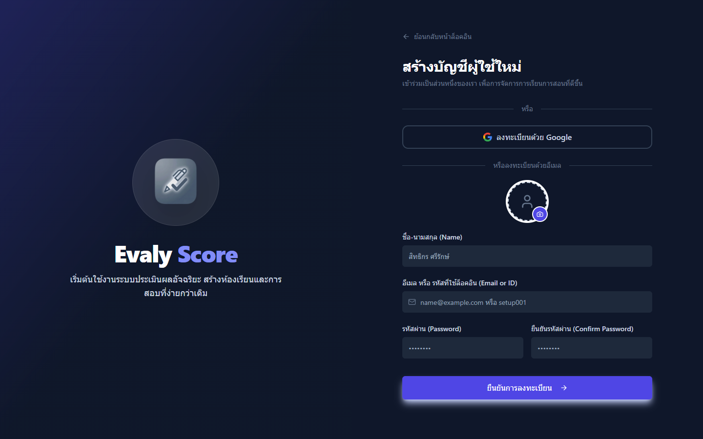
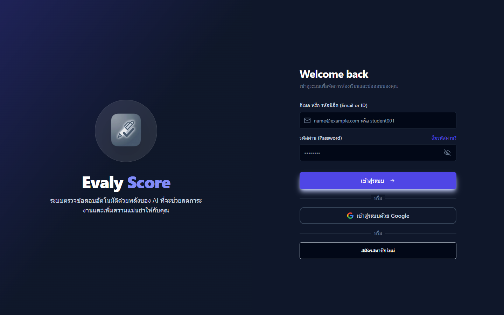
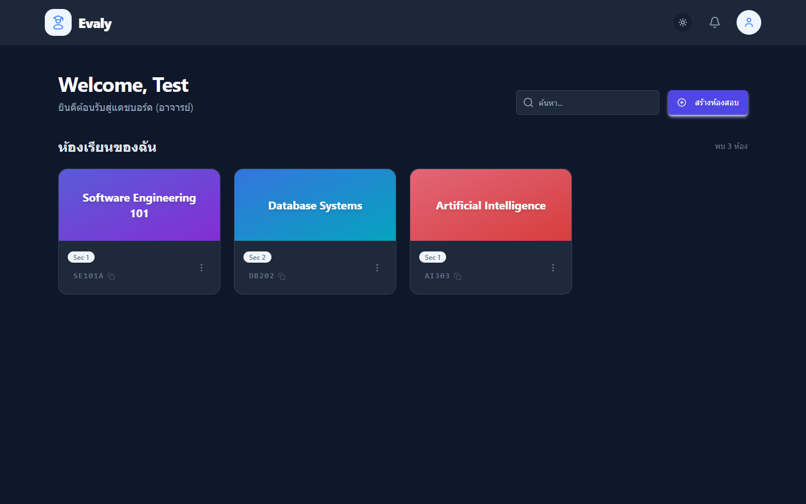
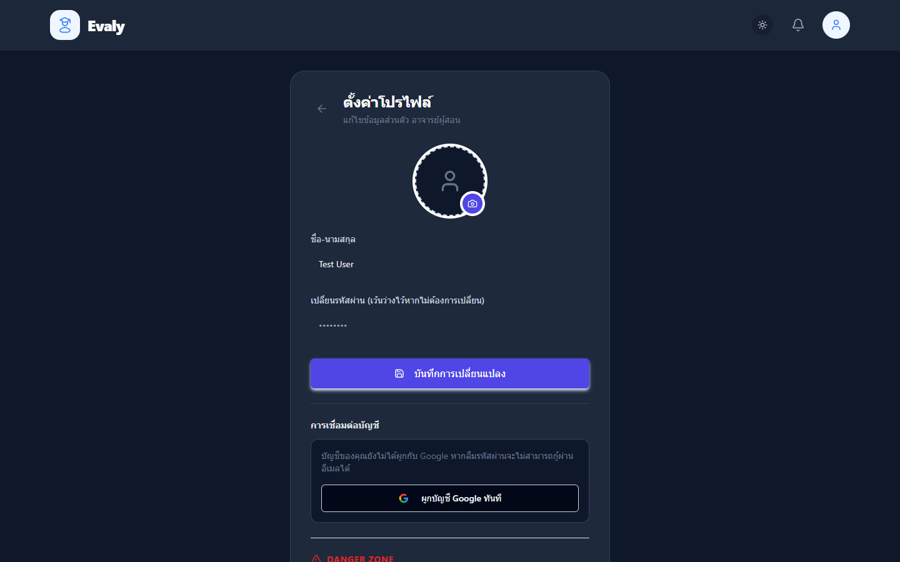
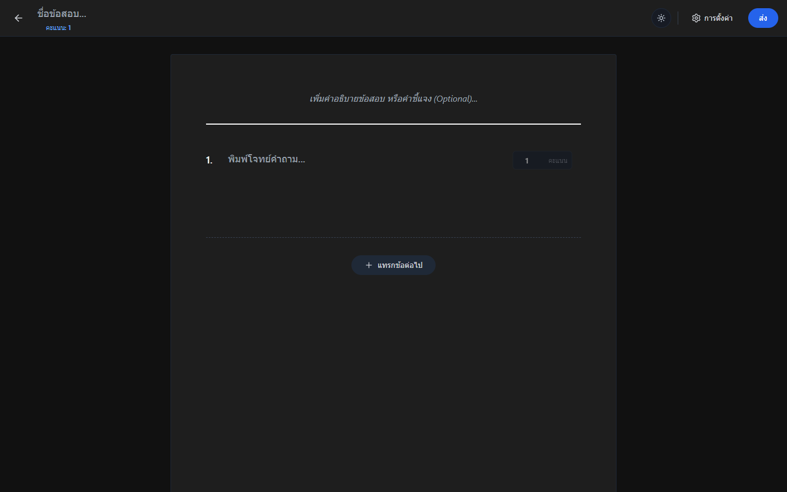
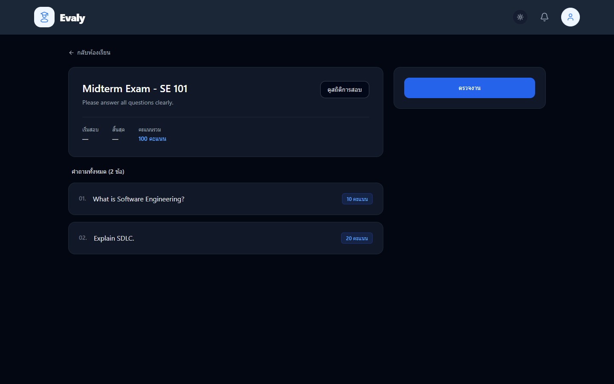
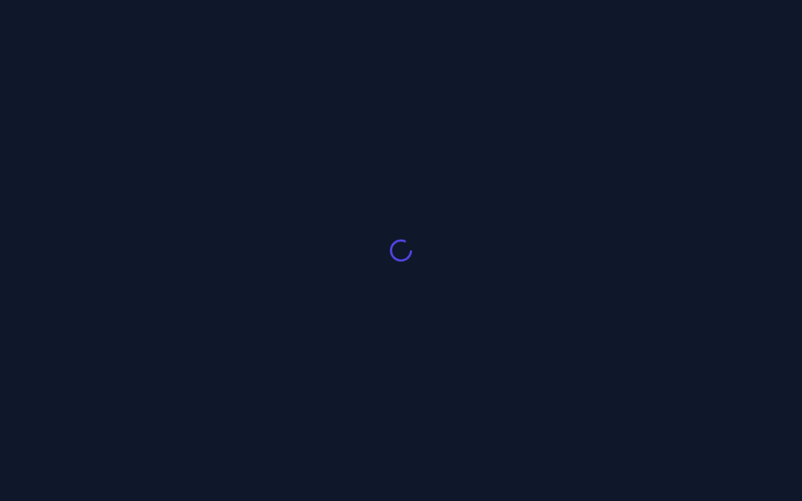

<div align="center">
  
  
  
</div>

<br />

<div align="center">
  <h1 align="center">🚀 Evaly: LLMs Auto Score System</h1>
  <p align="center">
    <strong>ระบบตรวจข้อสอบอัตโนมัติด้วยพลังของ Generative AI พร้อมระบบจัดการห้องเรียนครบวงจร</strong>
    <br />
    <br />
    <a href="#-features">✨ ฟีเจอร์หลัก</a>
    ·
    <a href="#-tech-stack">🛠 เทคโนโลยี</a>
    ·
    <a href="#-getting-started">🚀 การติดตั้ง</a>
    ·
    <a href="#-system-architecture">📐 สถาปัตยกรรมระบบ</a>
  </p>
</div>

---

## 💡 About The Project

**Evaly** เป็นนวัตกรรมระบบจัดการการศึกษาที่ผสานรวมความสามารถของ **Google Gemini Pro (Generative AI)** เพื่อช่วยแบ่งเบาภาระของผู้สอนในการตรวจข้อสอบแบบบรรยาย (Essay) ระบบไม่เพียงแต่ให้คะแนนได้อย่างแม่นยำ แต่ยังสามารถวิเคราะห์ลายมือจากรูปภาพ สร้างเกณฑ์การให้คะแนน (Rubrics) อัตโนมัติ และให้ Feedback เชิงลึกแก่นักเรียนเป็นรายบุคคล

<br/>

## 📸 Screenshots (ตัวอย่างหน้าเว็บ)

<table>
  <tr>
    <td align="center">
      
      <br />
      <b>หน้าสมัครสมาชิก (Register)</b>
    </td>
    <td align="center">
      
      <br />
      <b>หน้าแรก (Home / Login)</b>
    </td>
  </tr>
  <tr>
    <td align="center">
      
      <br />
      <b>หน้าแดชบอร์ดหลัก (Dashboard)</b>
    </td>
    <td align="center">
      
      <br />
      <b>หน้าโปรไฟล์ส่วนตัว (Profile)</b>
    </td>
  </tr>
  <tr>
    <td align="center">
      
      <br />
      <b>หน้ารายละเอียดห้องเรียน (Room Detail)</b>
    </td>
    <td align="center">
      
      <br />
      <b>หน้าสร้างข้อสอบ (Create Exam)</b>
    </td>
  </tr>
  <tr>
    <td align="center">
      
      <br />
      <b>หน้ารายละเอียดข้อสอบ (Exam View)</b>
    </td>
    <td align="center">
      
      <br />
      <b>หน้าวิเคราะห์คะแนนสอบ (Analytics)</b>
    </td>
  </tr>
</table>

<br/>

## ✨ Features (ฟีเจอร์เด่น)

- 🤖 **AI Auto-Grading**: ตรวจข้อสอบอัตโนมัติด้วย AI พร้อมให้ Feedback และวิเคราะห์ความมั่นใจ (Confidence Score)
- 📸 **Multimodal Support**: รองรับการส่งคำตอบทั้งรูปแบบข้อความ (Text) และอัปโหลด "รูปภาพลายมือ" (Vision OCR)
- 📝 **Auto-rubric Generation**: AI ช่วยสร้างเกณฑ์การให้คะแนน (Rubrics) และธงคำตอบอัตโนมัติจากโจทย์ ช่วยลดเวลาเตรียมสอน
- 🏫 **Classroom Management**: ระบบจัดการห้องเรียน, สมาชิก, และประกาศข่าวสาร
- ⚡ **Real-time Notifications**: แจ้งเตือนอัปเดตทันใจผ่านเทคโนโลยี WebSockets (Socket.io)
- ☁️ **Cloud Native**: จัดเก็บรูปภาพอย่างปลอดภัยบน Cloudinary และรองรับการทำ CI/CD 

<br/>

## 🛠 Tech Stack

### Frontend
   

### Backend & AI
  

### Database & Real-time
  

### Infrastructure
 

<br/>

## 🚀 Getting Started (วิธีการติดตั้ง)

### 1. คัดลอกโปรเจกต์และตั้งค่า Environment
```bash
git clone https://github.com/yourusername/LLMs-Auto-Score-System.git
cd LLMs-Auto-Score-System
cp .env.example .env
```
*(กรุณาแก้ไขไฟล์ `.env` โดยใส่ API Keys ที่จำเป็น เช่น Gemini API, Database URL)*

### 2. รันระบบด้วย Docker (แนะนำ 🌟)
รันทุกส่วนของระบบ (Frontend, Backend, Socket) ด้วยคำสั่งเดียว:
```bash
docker compose up --build
```
- **หน้าเว็บ (Frontend):** `http://localhost`
- **API (Backend):** `http://localhost:8000`

### 3. การรันแบบแยกส่วน (Manual Setup)
หากไม่ใช้ Docker สามารถรันผ่าน pnpm ได้โดยตรง:
```bash
pnpm install
pnpm dev:all   # รัน Frontend + Backend + Socket พร้อมกัน
```

<br/>

---

## 📐 System Architecture (สถาปัตยกรรมระบบ)

Evaly ถูกออกแบบมาให้เป็นระบบที่แยกส่วนการทำงาน (Microservices-oriented) เพื่อความยืดหยุ่นและรองรับการขยายตัว (Scalability) ในอนาคต โดยมีองค์ประกอบหลักดังนี้:

### 1. Client Layer (Frontend)
- **React 18 SPA (Single Page Application):** พัฒนาด้วย Vite มอบประสบการณ์ผู้ใช้ที่ลื่นไหล
- **State Management:** จัดการสถานะแอปพลิเคชันอย่างมีประสิทธิภาพ 
- **Real-time Listener:** เชื่อมต่อกับ Socket.io Client เพื่อรอรับการแจ้งเตือนแบบเรียลไทม์

### 2. Application Layer (Backend Services)
- **Core API (FastAPI):** เป็นหัวใจหลักในการจัดการ Business Logic ทั้งหมด (การจัดการผู้ใช้, ห้องเรียน, ข้อสอบ) ประมวลผลแบบ Asynchronous ทำให้รองรับ Request จำนวนมากได้พร้อมกัน
- **Real-time Server (Node.js & Socket.io):** แยกเซิร์ฟเวอร์สำหรับจัดการ WebSocket ออกมาโดยเฉพาะ เพื่อไม่ให้กระทบประสิทธิภาพของ API หลัก ทำหน้าที่ Broadcast การแจ้งเตือน

### 3. AI & External Services Layer
- **Google Gemini Pro:** รับหน้าที่ประมวลผล NLP และ Computer Vision (อ่านลายมือ) จากคำตอบของนักเรียน เปรียบเทียบกับ Rubrics และคืนผลลัพธ์เป็นโครงสร้าง (Structured Data)
- **Cloudinary:** จัดการการฝากไฟล์รูปภาพทั้งหมด พร้อมทำ Image Optimization ก่อนเก็บลงฐานข้อมูล
- **Firebase Auth:** จัดการการล็อกอินผ่าน Google เพื่อความปลอดภัยระดับ Enterprise

### 4. Data Layer (Database)
- **TiDB (MySQL-compatible):** ฐานข้อมูลแบบ Distributed SQL ที่รองรับการ Scale out ได้ง่าย และจัดการ Transaction ได้อย่างสมบูรณ์แบบ

### 🔄 Workflow การตรวจข้อสอบ (How AI Grading Works)
1. **Submission:** นักเรียนส่งคำตอบ (เป็นข้อความหรือรูปถ่ายลายมือ) เข้าสู่ระบบ
2. **Preprocessing:** ระบบ Backend นำรูปภาพอัปโหลดขึ้น Cloudinary และจัดเตรียม prompt
3. **AI Inference:** ส่งโจทย์, Rubrics, ธงคำตอบ และคำตอบของนักเรียน ไปให้ Google Gemini ประมวลผล
4. **Evaluation:** Gemini วิเคราะห์คำตอบ สร้าง Feedback และคำนวณ Confidence Score 
5. **Storage & Notify:** ระบบบันทึกผลลงฐานข้อมูล TiDB และยิง Webhook ไปหา Socket.io เพื่อแจ้งเตือนผู้สอนว่ามีข้อสอบรออนุมัติผล

---

<div align="center">
  <p>Made with ❤️ by the Evaly Team</p>
</div>
