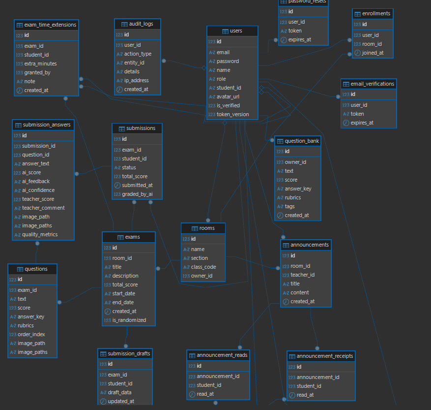

# Evaly Score - ระบบตรวจข้อสอบอัตนัยอัตโนมัติด้วย LLMs

## 1. ภาพรวมระบบ (System Overview)

Evaly Score เป็นแอปพลิเคชัน Web-based สำหรับตรวจข้อสอบอัตนัยอัตโนมัติ โดยใช้เทคโนโลยี Multimodal Large Language Models (LLMs) รองรับการตรวจคำตอบทั้งแบบพิมพ์และลายมือ ระบบถูกออกแบบสำหรับวิชา Data Structures แต่สามารถขยายไปใช้กับวิชาอื่นได้

---

## 2. สถาปัตยกรรมระบบ (System Architecture)

### 2.1 สถาปัตยกรรมแบบ 3-Tier

```
┌─────────────────────────────────────────────────────────────┐
│                    Frontend (React + Vite)                 │
│  - React 18 + TypeScript                                    │
│  - React Router 6 (SPA)                                      │
│  - TailwindCSS 3 + Radix UI                                  │
│  - TanStack Query (React Query)                             │
│  - Socket.io Client (Real-time)                              │
└─────────────────────────────────────────────────────────────┘
                              │
                              ▼
┌─────────────────────────────────────────────────────────────┐
│                    Backend Services                          │
│  ┌─────────────────┐  ┌─────────────────┐                    │
│  │  FastAPI (Py)   │  │  Node.js Socket │                    │
│  │  Port: 8001     │  │  Port: 3001     │                    │
│  │  - REST API     │  │  - WebSocket    │                    │
│  │  - AI Grading   │  │  - Push Noti    │                    │
│  │  - Cloudinary SDK│  │                 │                    │
│  └─────────────────┘  └─────────────────┘                    │
└─────────────────────────────────────────────────────────────┘
                              │
                              ▼
┌─────────────────────────────────────────────────────────────┐
│                    Data Layer                                │
│  - SQLite (dev.db)                                          │
│  - Google Gemini API                                        │
│  - Firebase Auth (Google Sign-In)                           │
│  - SMTP (Email Service)                                     │
└─────────────────────────────────────────────────────────────┘
```

---

## 3. ฟีเจอร์หลักตามประเภทผู้ใช้ (Features by User Type)

### 3.1 นักเรียน/ผู้เรียน (Student)

| ฟีเจอร์                            | รายละเอียด                                                                          | สถานะ | ไฟล์ที่เกี่ยวข้อง (Files) |
| ---------------------------------- | ----------------------------------------------------------------------------------- | ----- | ----------------------- |
| **3.1.1 สมัครสมาชิก**              | ลงทะเบียนด้วย ชื่อ, นามสกุล, รหัสนักเรียน, Email, Password, รูป Profile (ไม่บังคับ) | [x]   | `Register.tsx`, `auth_routes.py` |
| **3.1.2 เข้าสู่ระบบ**              | Email + Password และ Google Sign-In (Firebase Auth)                                 | [x]   | `Index.tsx`, `auth_routes.py` |
| **3.1.3 ยืนยันอีเมล**              | ระบบส่งลิงก์ยืนยันอีเมลผ่าน SMTP                                                    | [x]   | `VerifyEmail.tsx`, `auth_routes.py` |
| **3.1.4 แก้ไขโปรไฟล์**             | อัปเดต ชื่อ, นามสกุล, Password, รูป Profile                                         | [x]   | `Profile.tsx`, `auth_routes.py` |
| **3.1.5 เข้าร่วมห้องเรียน**        | Join ด้วย Class Code 6 หลัก                                                         | [x]   | `Home.tsx`, `room_routes.py` |
| **3.1.6 ออกจากห้องเรียน**          | ลบการเข้าร่วมห้องเรียน                                                              | [x]   | `RoomDetail.tsx`, `room_routes.py` |
| **3.1.7 ทำข้อสอบ**                 | 2 รูปแบบ: พิมพ์คำตอบ / อัปโหลดรูปภาพลายมือ                                          | [x]   | `ExamSubmit.tsx`, `exam_routes.py` |
| **3.1.8 จับเวลาสอบ**               | Timer Countdown + แจ้งเตือนใกล้หมดเวลา                                              | [x]   | `ExamSubmit.tsx` |
| **3.1.9 ดูสถานะการส่ง**            | ยังไม่ส่ง / ส่งแล้ว (รอตรวจ) / ตรวจแล้ว                                             | [x]   | `Home.tsx`, `RoomDetail.tsx` |
| **3.1.10 ดูผลคะแนน**               | ดูคะแนนและข้อเสนอแนะหลังอาจารย์อนุมัติ                                              | [x]   | `StudentHistory.tsx` |
| **3.1.11 ประวัติการสอบ**           | ดูประวัติการทำข้อสอบย้อนหลังทุกห้องเรียน                                            | [x]   | `StudentHistory.tsx` |
| **3.1.12 Real-time Notifications** | แจ้งเตือนเมื่อมีข้อสอบใหม่, ใกล้หมดเวลา, ประกาศผล                                   | [x]   | `Navbar.tsx`, `notification_service.py` |
| **3.1.13 Auto-save Draft**         | บันทึกคำตอบอัตโนมัติระหว่างทำข้อสอบ ป้องกันข้อมูลหาย                                | [x]   | `ExamSubmit.tsx` |
| **3.1.14 Time Extension**          | รองรับการขยายเวลาสอบรายบุคคลตามที่อาจารย์กำหนด                                     | [x]   | `ExamSubmit.tsx`, `exam_routes.py` |

### 3.2 อาจารย์/ผู้สอน (Teacher)

| ฟีเจอร์                       | รายละเอียด                                               | สถานะ | ไฟล์ที่เกี่ยวข้อง (Files) |
| ----------------------------- | -------------------------------------------------------- | ----- | ----------------------- |
| **3.2.1 สมัครสมาชิก**         | ลงทะเบียนด้วย ชื่อ, นามสกุล, รหัสผู้สอน, Email, Password | [x]   | `Register.tsx`, `auth_routes.py` |
| **3.2.2 เข้าสู่ระบบ**         | Email + Password และ Google Sign-In                      | [x]   | `Index.tsx`, `auth_routes.py` |
| **3.2.3 จัดการห้องเรียน**     | เพิ่ม, ลบ, แก้ไขห้องเรียน + ดู Class Code                | [x]   | `Home.tsx`, `room_routes.py` |
| **3.2.4 ค้นหาห้องเรียน**      | ค้นหาด้วยชื่อหรือรหัสห้อง                                | [x]   | `Home.tsx` |
| **3.2.5 จัดการข้อสอบ**        | สร้าง, แก้ไข, ลบข้อสอบพร้อมโจทย์และธงคำตอบ               | [x]   | `CreateExam.tsx`, `EditExam.tsx` |
| **3.2.6 กำหนดเวลาสอบ**        | กำหนดวัน/เวลาเริ่มต้น - สิ้นสุด (ไม่บังคับ)              | [x]   | `CreateExam.tsx`, `EditExam.tsx` |
| **3.2.7 อัปโหลดรูปโจทย์**     | รองรับหลายรูปภาพต่อข้อ (base64 + จัดเก็บใน uploads)      | [x]   | `CreateExam.tsx`, `exam_routes.py` |
| **3.2.8 กำหนด Rubrics**       | กำหนดเกณฑ์การให้คะแนนแบบละเอียด                          | [x]   | `CreateExam.tsx`, `EditExam.tsx` |
| **3.2.9 ตรวจสอบการส่ง**       | ดูสถานะนักเรียนทุกคน (ส่งแล้ว/ยังไม่ส่ง)                 | [x]   | `RoomReview.tsx`, `ExamScoreboard.tsx` |
| **3.2.10 ตรวจคำตอบ**          | ดูคำตอบนักเรียน พร้อม AI Score และ Feedback              | [x]   | `StudentGrading.tsx` |
| **3.2.11 แก้ไขคะแนน**         | แก้ไขคะแนนที่ AI ให้ + เพิ่มคอมเมนต์ส่วนตัว              | [x]   | `StudentGrading.tsx` |
| **3.2.12 อนุมัติผล**          | อนุมัติคะแนนเพื่อประกาศให้นักเรียนทราบ                   | [x]   | `StudentGrading.tsx`, `exam_routes.py` |
| **3.2.13 Bulk Approve**       | อนุมัติหลายคนพร้อมกันผ่าน Floating Action Bar            | [x]   | `ExamScoreboard.tsx`, `exam_routes.py` |
| **3.2.14 สถิติและ Analytics** | ดูรายงานคะแนนเฉลี่ย, การกระจายคะแนน, ความยากของข้อ       | [x]   | `TeacherAnalytics.tsx`, `RoomAnalytics.tsx` |
| **3.2.15 Export ข้อมูล**      | ส่งออก CSV/XLSX รองรับภาษาไทย 100%                       | [x]   | `ExamScoreboard.tsx`, `exam_routes.py` |
| **3.2.16 Question Bank**      | คลังข้อสอบส่วนตัวที่ใช้ซ้ำได้ข้ามห้องเรียน               | [x]   | `CreateExam.tsx`, `question_bank_routes.py` |
| **3.2.17 Announcements**      | ระบบประกาศข่าวสารภายในห้องเรียน                          | [x]   | `RoomDetail.tsx`, `room_routes.py` |
| **3.2.18 Audit Log**          | ตรวจสอบประวัติการใช้งานและการแก้ไขคะแนนย้อนหลัง          | [x]   | `AuditLog.tsx`, `audit_routes.py` |
| **3.2.19 Time Extension Management**| จัดการเพิ่มเวลาสอบให้นักเรียนรายบุคคล                | [x]   | `RoomReview.tsx`, `exam_routes.py` |
| **3.2.20 Google Docs-Style Editor**| สร้างข้อสอบผ่าน UI ที่ลื่นไหล มี Floating actions        | [x]   | `CreateExam.tsx`, `EditExam.tsx` |
| **3.2.21 Exam Auto-save Draft**    | แบบร่างข้อสอบถูกบันทึกอัตโนมัติ (LocalStorage)            | [x]   | `CreateExam.tsx`, `EditExam.tsx` |
| **3.2.22 Rubric Presets**          | บันทึกและเรียกใช้เทมเพลตเกณฑ์การให้คะแนน                | [x]   | `CreateExam.tsx`, `exam_routes.py` |

### 3.3 ระบบ AI Grading (Core System)

| ฟีเจอร์                      | รายละเอียด                                                   | สถานะ | ไฟล์ที่เกี่ยวข้อง (Files) |
| ---------------------------- | ------------------------------------------------------------ | ----- | ----------------------- |
| **3.3.1 Multimodal Scoring** | รองรับ Text + Image (Vision) ในครั้งเดียว                    | [x]   | `ai_service.py` |
| **3.3.2 Gemini AI**          | ใช้ Google Gemini 1.5 Flash/Pro เป็นตัวตรวจ                  | [x]   | `ai_service.py` |
| **3.3.3 Prompt Engineering** | Chain-of-Thought + Few-Shot Prompting สำหรับ Data Structures | [x]   | `ai_service.py` |
| **3.3.4 Rubric-based**       | ตรวจตามเกณฑ์รูบริคที่อาจารย์กำหนด                            | [x]   | `ai_service.py` |
| **3.3.5 Confidence Score**   | ให้ค่าความมั่นใจ (high/medium/low) สำหรับแต่ละคำตอบ          | [x]   | `ai_service.py`, `StudentGrading.tsx` |
| **3.3.6 Fallback Scoring**   | ระบบสำรองแบบ Rule-based เมื่อ AI ไม่พร้อมใช้งาน              | [x]   | `ai_service.py` |
| **3.3.7 การแจ้งเตือน**       | แจ้งเตือนอาจารย์เมื่อตรวจเสร็จหรือต้องตรวจเอง                | [x]   | `notification_service.py`, `ai_service.py` |
| **3.3.8 การจำกัดข้อความ**    | รองรับคำตอบสูงสุด 300 คำต่อข้อ                               | [x]   | `ExamSubmit.tsx`, `ai_service.py` |
| **3.3.9 Auto-rubric Generation**| AI ช่วยสร้างเกณฑ์การให้คะแนนอัตโนมัติจากโจทย์                | [x]   | `CreateExam.tsx`, `ai_routes.py` |
| **3.3.10 Grading Tone Selection**| เลือกระดับความเข้มงวดการให้คะแนน (เรียบง่าย, ปานกลาง, วิชาการ)| [x]   | `StudentGrading.tsx`, `ai_service.py` |
| **3.3.11 Batch Grading Queue** | ระบบ Queue ประมวลผลการตรวจจำนวนมากแบบเบื้องหลัง (Async)      | [x]   | `exam_routes.py`, `ai_service.py` |
| **3.3.12 Smart Rescoring**     | ปรับคะแนนอัตโนมัติเมื่อมีการแก้ไขเกณฑ์รูบริคย้อนหลัง          | [x]   | `StudentGrading.tsx`, `ai_service.py` |
| **3.3.13 Essay Quality Metrics**| วิเคราะห์คุณภาพคำตอบ (ความยาว, ความซับซ้อน, Readability)    | [x]   | `ai_service.py`, `StudentGrading.tsx` |

---

## 4. เทคโนโลยีและเทคนิค (Technologies & Techniques)

### 4.1 Frontend Stack

| เทคโนโลยี        | รุ่น     | วัตถุประสงค์                    |
| ---------------- | -------- | ------------------------------- |
| React            | 18.3.1   | UI Library                      |
| TypeScript       | 5.9.2    | Type Safety                     |
| Vite             | 7.1.2    | Build Tool                      |
| React Router DOM | 6.30.1   | SPA Routing                     |
| TailwindCSS      | 3.4.17   | CSS Framework                   |
| Radix UI         | latest   | Headless UI Components          |
| TanStack Query   | 5.84.2   | Data Fetching & Caching         |
| Socket.io Client | 4.8.3    | Real-time Communication         |
| Firebase         | 12.12.0  | Authentication (Google Sign-In) |
| Recharts         | 2.12.7   | Data Visualization              |
| Framer Motion    | 12.23.12 | Animations                      |
| React Hook Form  | 7.62.0   | Form Management                 |
| Zod              | 3.25.76  | Schema Validation               |
| date-fns         | 4.1.0    | Date Manipulation               |
| Lucide React     | 0.539.0  | Icons                           |

### 4.2 Backend Stack

| เทคโนโลยี      | รุ่น   | วัตถุประสงค์          |
| -------------- | ------ | --------------------- |
| FastAPI        | latest | Python Web Framework  |
| Uvicorn        | latest | ASGI Server           |
| TiDB Cloud      | 4000   | Cloud MySQL Database |
| PyMySQL         | latest | MySQL Driver (Python)|
| python-jose    | latest | JWT Handling          |
| google-genai   | latest | Gemini API Client     |
| firebase-admin | latest | Firebase Admin SDK    |
| python-dotenv  | latest | Environment Variables |
| aiofiles       | latest | Async File Operations |
| httpx          | latest | HTTP Client           |
| openpyxl       | latest | XLSX Export           |
| Cloudinary      | latest | Image Cloud Storage   |

### 4.3 Real-time & Socket Server

| เทคโนโลยี | รุ่น   | วัตถุประสงค์          |
| --------- | ------ | --------------------- |
| Node.js   | 18+    | Runtime               |
| Express   | 4.x    | Web Framework         |
| Socket.io | 4.x    | WebSocket Server      |
| CORS      | latest | Cross-origin handling |

### 4.4 Security & Authentication

| เทคนิค/เทคโนโลยี     | รายละเอียด                          |
| -------------------- | ----------------------------------- |
| JWT (JSON Web Token) | Access Token อายุ 7 วัน             |
| PBKDF2-SHA256        | Password Hashing (100,000 rounds)   |
| Rate Limiting        | IP-based limiting (login, register) |
| CORS                 | Cross-Origin Resource Sharing       |
| Email Verification   | 24-hour expiry token                |
| Password Reset       | 1-hour expiry token + self-service  |
| Firebase Auth        | Google Sign-In integration          |

### 4.5 AI & Prompt Engineering

| เทคนิค              | รายละเอียด                   |
| ------------------- | ---------------------------- |
| Chain-of-Thought    | ให้ AI คิดเป็นขั้นตอนก่อนตอบ |
| Few-Shot Prompting  | ตัวอย่างการให้คะแนนในพรอมต์  |
| Multimodal Input    | ส่งทั้งข้อความและรูปภาพ      |
| Temperature Control | 0.2 (consistent scoring)     |
| Confidence Scoring  | วิเคราะห์ความมั่นใจของคำตอบ  |
| Fallback Heuristic  | กรณี AI ไม่พร้อมใช้งาน       |

---

## 5. โครงสร้างฐานข้อมูล (Database Schema)

### 5.1 ภาพรวมความสัมพันธ์ (Entity Relationship Overview)



### 5.2 รายละเอียดตารางข้อมูล (Tables & Entities)

#### 1. `users` (ตารางผู้ใช้งาน)
| ชื่อฟิลด์ | ชนิดข้อมูล | คีย์ | คำอธิบาย |
| --- | --- | --- | --- |
| `id` | INTEGER | PK | รหัสผู้ใช้งาน (Auto Increment) |
| `email` | VARCHAR(255) | UNIQUE | อีเมลผู้ใช้งาน |
| `password` | VARCHAR(255) | - | รหัสผ่าน (Hashed ด้วย PBKDF2) |
| `name` | VARCHAR(255) | - | ชื่อ-นามสกุล |
| `role` | VARCHAR(50) | - | บทบาท (`teacher` / `student`) |
| `student_id` | VARCHAR(100) | - | รหัสนักเรียน/รหัสประจำตัว |
| `avatar_url` | TEXT | - | ลิงก์รูปโปรไฟล์ (Cloudinary URL) |
| `is_verified` | TINYINT | - | สถานะยืนยันอีเมล (0 = ยัง, 1 = ยืนยันแล้ว) |
| `token_version` | INTEGER | - | เวอร์ชันของ Token (สำหรับบังคับ Logout) |

#### 2. `rooms` (ตารางห้องเรียน)
| ชื่อฟิลด์ | ชนิดข้อมูล | คีย์ | คำอธิบาย |
| --- | --- | --- | --- |
| `id` | INTEGER | PK | รหัสห้องเรียน (Auto Increment) |
| `name` | VARCHAR(255) | - | ชื่อห้องเรียน/วิชา |
| `section` | VARCHAR(100) | - | กลุ่มเรียน (Section) |
| `class_code` | VARCHAR(50) | UNIQUE | รหัสเข้าร่วมห้องเรียน (6 หลัก) |
| `owner_id` | INTEGER | FK | รหัสผู้สอน (อ้างอิง `users.id`) |

#### 3. `enrollments` (ตารางการเข้าร่วมห้องเรียน)
| ชื่อฟิลด์ | ชนิดข้อมูล | คีย์ | คำอธิบาย |
| --- | --- | --- | --- |
| `id` | INTEGER | PK | รหัสการเข้าร่วม (Auto Increment) |
| `user_id` | INTEGER | FK | รหัสผู้เรียน (อ้างอิง `users.id`) |
| `room_id` | INTEGER | FK | รหัสห้องเรียน (อ้างอิง `rooms.id`) |
| `joined_at` | DATETIME | - | วันเวลาที่เข้าร่วม |

#### 4. `exams` (ตารางข้อสอบ)
| ชื่อฟิลด์ | ชนิดข้อมูล | คีย์ | คำอธิบาย |
| --- | --- | --- | --- |
| `id` | INTEGER | PK | รหัสข้อสอบ (Auto Increment) |
| `room_id` | INTEGER | FK | รหัสห้องเรียน (อ้างอิง `rooms.id`) |
| `title` | VARCHAR(255) | - | ชื่อข้อสอบ |
| `description` | TEXT | - | คำอธิบาย/คำชี้แจง |
| `total_score` | FLOAT | - | คะแนนรวม |
| `start_date` | VARCHAR(100) | - | วันเวลาเปิดสอบ (ISO String) |
| `end_date` | VARCHAR(100) | - | วันเวลาปิดสอบ (ISO String) |
| `is_randomized` | TINYINT | - | สลับลำดับข้อสอบ (0 = ไม่สลับ, 1 = สลับ) |
| `created_at` | DATETIME | - | วันเวลาที่สร้าง |

#### 5. `questions` (ตารางโจทย์ข้อสอบ)
| ชื่อฟิลด์ | ชนิดข้อมูล | คีย์ | คำอธิบาย |
| --- | --- | --- | --- |
| `id` | INTEGER | PK | รหัสข้อ (Auto Increment) |
| `exam_id` | INTEGER | FK | รหัสข้อสอบ (อ้างอิง `exams.id`) |
| `text` | TEXT | - | โจทย์คำถาม |
| `score` | FLOAT | - | คะแนนประจำข้อ |
| `answer_key` | TEXT | - | ธงคำตอบ/แนวคำตอบ |
| `rubrics` | TEXT | - | เกณฑ์การให้คะแนน (Rubrics JSON) |
| `order_index` | INTEGER | - | ลำดับข้อ |
| `image_path` | TEXT | - | รูปภาพประกอบโจทย์ (รูปเดียว) |
| `image_paths` | TEXT | - | รูปภาพประกอบโจทย์ (หลายรูป JSON) |

#### 6. `submissions` (ตารางการส่งข้อสอบ)
| ชื่อฟิลด์ | ชนิดข้อมูล | คีย์ | คำอธิบาย |
| --- | --- | --- | --- |
| `id` | INTEGER | PK | รหัสการส่ง (Auto Increment) |
| `exam_id` | INTEGER | FK | รหัสข้อสอบ (อ้างอิง `exams.id`) |
| `student_id` | INTEGER | FK | รหัสผู้เรียน (อ้างอิง `users.id`) |
| `status` | VARCHAR(50) | - | สถานะ (`missing`, `submitted`, `graded`) |
| `total_score` | FLOAT | - | คะแนนรวมที่ได้ |
| `submitted_at` | DATETIME | - | วันเวลาที่ส่งคำตอบ |
| `graded_by_ai` | TINYINT | - | สถานะการตรวจด้วย AI (0 = ยัง, 1 = ตรวจแล้ว) |

#### 7. `submission_answers` (ตารางคำตอบรายข้อของนักเรียน)
| ชื่อฟิลด์ | ชนิดข้อมูล | คีย์ | คำอธิบาย |
| --- | --- | --- | --- |
| `id` | INTEGER | PK | รหัสคำตอบ (Auto Increment) |
| `submission_id` | INTEGER | FK | รหัสการส่ง (อ้างอิง `submissions.id`) |
| `question_id` | INTEGER | FK | รหัสโจทย์ (อ้างอิง `questions.id`) |
| `answer_text` | TEXT | - | ข้อความคำตอบที่นักเรียนพิมพ์ |
| `ai_score` | FLOAT | - | คะแนนที่ AI ประเมิน |
| `ai_feedback` | TEXT | - | คำอธิบาย/ข้อเสนอแนะจาก AI |
| `ai_confidence` | VARCHAR(50) | - | ระดับความมั่นใจของ AI (`high`, `medium`, `low`) |
| `teacher_score` | FLOAT | - | คะแนนที่อาจารย์ปรับแก้ |
| `teacher_comment` | TEXT | - | คอมเมนต์เพิ่มเติมจากอาจารย์ |
| `image_path` | TEXT | - | รูปภาพคำตอบลายมือ (รูปเดียว) |
| `image_paths` | TEXT | - | รูปภาพคำตอบลายมือ (หลายรูป JSON) |
| `quality_metrics` | TEXT | - | ข้อมูลการวิเคราะห์คุณภาพคำตอบ (JSON) |

#### 8. `submission_drafts` (ตารางบันทึกร่างคำตอบอัตโนมัติ)
| ชื่อฟิลด์ | ชนิดข้อมูล | คีย์ | คำอธิบาย |
| --- | --- | --- | --- |
| `id` | INTEGER | PK | รหัสบันทึกร่าง (Auto Increment) |
| `exam_id` | INTEGER | FK | รหัสข้อสอบ (อ้างอิง `exams.id`) |
| `student_id` | INTEGER | FK | รหัสผู้เรียน (อ้างอิง `users.id`) |
| `draft_data` | TEXT | - | ข้อมูลร่างคำตอบ (JSON) |
| `updated_at` | DATETIME | - | วันเวลาที่บันทึกร่างล่าสุด |

#### 9. `exam_time_extensions` (ตารางการขยายเวลาสอบรายบุคคล)
| ชื่อฟิลด์ | ชนิดข้อมูล | คีย์ | คำอธิบาย |
| --- | --- | --- | --- |
| `id` | INTEGER | PK | รหัสการขยายเวลา (Auto Increment) |
| `exam_id` | INTEGER | FK | รหัสข้อสอบ (อ้างอิง `exams.id`) |
| `student_id` | INTEGER | FK | รหัสผู้เรียน (อ้างอิง `users.id`) |
| `extra_minutes` | INTEGER | - | จำนวนนาทีที่เพิ่มให้ |
| `granted_by` | INTEGER | FK | รหัสผู้สอนที่อนุมัติ (อ้างอิง `users.id`) |
| `note` | TEXT | - | หมายเหตุ/เหตุผล |
| `created_at` | DATETIME | - | วันเวลาที่บันทึก |

#### 10. `question_bank` (ตารางคลังข้อสอบส่วนตัว)
| ชื่อฟิลด์ | ชนิดข้อมูล | คีย์ | คำอธิบาย |
| --- | --- | --- | --- |
| `id` | INTEGER | PK | รหัสข้อสอบในคลัง (Auto Increment) |
| `owner_id` | INTEGER | FK | รหัสผู้สอน (อ้างอิง `users.id`) |
| `text` | TEXT | - | โจทย์คำถาม |
| `score` | FLOAT | - | คะแนน |
| `answer_key` | TEXT | - | ธงคำตอบ |
| `rubrics` | TEXT | - | เกณฑ์การให้คะแนน (Rubrics JSON) |
| `tags` | VARCHAR(500) | - | ป้ายกำกับ (Tags สำหรับค้นหา) |
| `created_at` | DATETIME | - | วันเวลาที่บันทึกเข้าคลัง |

#### 11. `announcements` (ตารางประกาศข่าวสารในห้องเรียน)
| ชื่อฟิลด์ | ชนิดข้อมูล | คีย์ | คำอธิบาย |
| --- | --- | --- | --- |
| `id` | INTEGER | PK | รหัสประกาศ (Auto Increment) |
| `room_id` | INTEGER | FK | รหัสห้องเรียน (อ้างอิง `rooms.id`) |
| `teacher_id` | INTEGER | FK | รหัสผู้สอน (อ้างอิง `users.id`) |
| `title` | VARCHAR(255) | - | หัวข้อประกาศ |
| `content` | TEXT | - | เนื้อหาประกาศ |
| `created_at` | DATETIME | - | วันเวลาที่ประกาศ |

#### 12. `announcement_reads` (ตารางสถานะการอ่านประกาศ)
| ชื่อฟิลด์ | ชนิดข้อมูล | คีย์ | คำอธิบาย |
| --- | --- | --- | --- |
| `id` | INTEGER | PK | รหัสสถานะการอ่าน (Auto Increment) |
| `announcement_id` | INTEGER | FK | รหัสประกาศ (อ้างอิง `announcements.id`) |
| `student_id` | INTEGER | FK | รหัสผู้เรียน (อ้างอิง `users.id`) |
| `read_at` | DATETIME | - | วันเวลาที่เปิดอ่าน |

#### 13. `password_resets` & `email_verifications` (ตารางจัดการโทเค็นความปลอดภัย)
* **`password_resets`**: ตารางเก็บ Token สำหรับรีเซ็ตรหัสผ่าน (`id`, `user_id`, `token`, `expires_at`)
* **`email_verifications`**: ตารางเก็บ Token สำหรับยืนยันอีเมล (`id`, `user_id`, `token`, `expires_at`)

---

## 6. API Endpoints

### 6.1 Authentication (`/api/auth/*`)

| Method | Endpoint               | คำอธิบาย                     |
| ------ | ---------------------- | ---------------------------- |
| POST   | `/register`            | สมัครสมาชิก + ส่งอีเมลยืนยัน |
| POST   | `/login`               | เข้าสู่ระบบ                  |
| POST   | `/firebase-login`      | เข้าสู่ระบบด้วย Google       |
| POST   | `/link-google`         | เชื่อมโยงบัญชี Google เข้ากับบัญชีเดิม |
| POST   | `/set-role`            | กำหนดบทบาทผู้ใช้ (Teacher/Student) |
| GET    | `/me`                  | ดูข้อมูลผู้ใช้ปัจจุบัน       |
| PUT    | `/profile`             | อัปเดตโปรไฟล์                |
| POST   | `/forgot-password`     | ขอรีเซ็ตรหัสผ่าน             |
| POST   | `/reset-password`      | รีเซ็ตรหัสผ่านด้วย token     |
| POST   | `/verify-email`        | ยืนยันอีเมล                  |
| POST   | `/resend-verification` | ส่งอีเมลยืนยันอีกครั้ง       |

### 6.2 Rooms (`/api/rooms/*`)

| Method | Endpoint                   | คำอธิบาย                    |
| ------ | -------------------------- | --------------------------- |
| POST   | `/`                        | สร้างห้องเรียน              |
| GET    | `/`                        | ดูห้องเรียนทั้งหมด          |
| PUT    | `/{id}`                    | แก้ไขห้อง                   |
| DELETE | `/{id}`                    | ลบห้อง                      |
| POST   | `/join`                    | เข้าร่วมห้องด้วย Class Code |
| GET    | `/{id}`                    | ดูรายละเอียดห้อง            |
| GET    | `/{id}/members`            | ดูสมาชิกในห้อง              |
| POST   | `/{id}/announcements`      | สร้างประกาศใหม่             |
| GET    | `/{id}/announcements`      | ดูประกาศทั้งหมดในห้อง       |
| GET    | `/{id}/analytics`          | ดูสถิติระดับห้อง            |
| GET    | `/{id}/export-summary-csv` | Export สรุปคะแนนทั้งห้อง    |

### 6.3 Exams (`/api/rooms/{room_id}/exams/*`)

| Method | Endpoint                                      | คำอธิบาย                     |
| ------ | --------------------------------------------- | ---------------------------- |
| POST   | `/`                                           | สร้างข้อสอบ                  |
| GET    | `/`                                           | ดูข้อสอบทั้งหมดในห้อง        |
| GET    | `/{exam_id}`                                  | ดูรายละเอียดข้อสอบ           |
| PUT    | `/{exam_id}`                                  | แก้ไขข้อสอบ                  |
| DELETE | `/{exam_id}`                                  | ลบข้อสอบ                     |
| POST   | `/{exam_id}/submit`                           | ส่งคำตอบ (JSON)              |
| POST   | `/{exam_id}/submit-multipart`                 | ส่งคำตอบ (FormData + รูปภาพ) |
| POST   | `/{exam_id}/draft`                            | บันทึก Draft (Auto-save)     |
| GET    | `/{exam_id}/draft`                            | ดึงข้อมูล Draft              |
| DELETE | `/{exam_id}/draft`                            | ลบข้อมูล Draft               |
| GET    | `/{exam_id}/submissions`                      | ดูรายการส่งทั้งหมด           |
| GET    | `/{exam_id}/submissions/me`                   | ดูคำตอบตัวเอง                |
| GET    | `/{exam_id}/submissions/{student_id}`         | ดูคำตอบนักเรียน              |
| PUT    | `/{exam_id}/submissions/{student_id}/approve` | อนุมัติคะแนน                 |
| POST   | `/{exam_id}/bulk-approve`                     | อนุมัติหลายคนพร้อมกัน        |
| POST   | `/{exam_id}/questions/{question_id}/rescore`  | สั่งให้ AI ตรวจข้อนี้ใหม่ (Smart Rescore) |
| POST   | `/{exam_id}/extensions`                       | เพิ่มเวลาสอบรายบุคคล         |
| GET    | `/{exam_id}/extensions`                       | ดูข้อมูลการต่อเวลาทั้งหมดของข้อสอบ |
| GET    | `/{exam_id}/extensions/me`                    | ดูข้อมูลการต่อเวลาของตัวเอง   |
| GET    | `/{exam_id}/export`                           | Export คะแนน (CSV/XLSX)      |

### 6.4 Notifications (`/api/notifications`)

| Method | Endpoint | คำอธิบาย              |
| ------ | -------- | --------------------- |
| GET    | `/`      | ดูการแจ้งเตือนทั้งหมด |

### 6.5 Question Bank (`/api/question-bank/*`)

| Method | Endpoint              | คำอธิบาย                     |
| ------ | --------------------- | ---------------------------- |
| GET    | `/`                   | ดูคลังข้อสอบทั้งหมด          |
| POST   | `/`                   | เพิ่มข้อสอบเข้าคลัง          |
| DELETE | `/{question_id}`      | ลบข้อสอบจากคลัง              |
| POST   | `/save-from-exam`     | บันทึกจากข้อสอบที่มีอยู่แล้ว |

### 6.6 System, AI & Utilities

| Method | Endpoint                  | คำอธิบาย                          |
| ------ | ------------------------- | --------------------------------- |
| POST   | `/api/gemini/generate-rubric` | ให้ AI ช่วยสร้างเกณฑ์คะแนน (Rubrics) |
| GET    | `/api/submissions/me`     | ดูประวัติการทำข้อสอบทุกวิชารวมกัน (ของตัวเอง) |
| POST   | `/api/announcements/{ann_id}/read` | ยืนยันการอ่านประกาศ (Read Receipt) |
| GET    | `/api/announcements/{ann_id}/read-status` | ดูสถานะการอ่านประกาศของผู้ใช้ |
| GET    | `/api/ping`               | เช็คสถานะ Server                  |

### 6.5 Socket Server (`server-node/index.js`)

| Event               | Direction       | คำอธิบาย               |
| ------------------- | --------------- | ---------------------- |
| `join_room`         | Client → Server | เข้าร่วมห้องแจ้งเตือน  |
| `new_notification`  | Server → Client | ส่งการแจ้งเตือน        |
| `emit-notification` | Python → Node   | Bridge ส่งการแจ้งเตือน |

---

## 7. โครงสร้างโปรเจค (Project Structure)

```
LLMs-Auto-Score-System-main/
├── client/                          # React Frontend
│   ├── pages/                       # Route Components
│   │   ├── Index.tsx               # Landing/Login Page
│   │   ├── Register.tsx            # Registration Page
│   │   ├── Home.tsx                # Dashboard (Teacher/Student)
│   │   ├── RoomDetail.tsx          # Room Detail View
│   │   ├── CreateExam.tsx          # Create Exam Form
│   │   ├── EditExam.tsx            # Edit Exam Form
│   │   ├── ExamView.tsx            # Student Exam View
│   │   ├── ExamSubmit.tsx          # Exam Submission
│   │   ├── RoomReview.tsx          # Teacher Review All
│   │   ├── StudentGrading.tsx      # Grade Individual Student
│   │   ├── TeacherAnalytics.tsx    # Exam Analytics
│   │   ├── RoomAnalytics.tsx       # Room Analytics
│   │   ├── ExamScoreboard.tsx      # Score Overview
│   │   ├── StudentHistory.tsx      # Student Submission History
│   │   ├── Profile.tsx             # User Profile
│   │   ├── ForgotPassword.tsx      # Password Recovery
│   │   ├── ResetPassword.tsx       # Reset Password
│   │   ├── VerifyEmail.tsx         # Email Verification
│   │   └── NotFound.tsx            # 404 Page
│   │
│   ├── components/                  # Reusable Components
│   │   ├── ui/                     # Radix UI Components (49 items)
│   │   ├── Navbar.tsx              # Navigation Bar
│   │   └── GoogleSignInButton.tsx # Google Auth Button
│   │
│   ├── contexts/                    # React Contexts
│   │   └── AuthContext.tsx         # Authentication State + Socket
│   │
│   ├── hooks/                       # Custom Hooks
│   │   ├── use-toast.ts            # Toast Notifications
│   │   └── use-mobile.tsx          # Mobile Detection
│   │
│   ├── lib/                         # Utilities
│   │   ├── utils.ts                # Helper Functions (cn)
│   │   ├── firebase.ts             # Firebase Config
│   │   └── utils.spec.ts           # Tests
│   │
│   ├── App.tsx                      # Main App with Routes
│   ├── main.tsx                     # Entry Point
│   ├── global.css                   # Tailwind + Theme
│   └── index.html                   # HTML Template
│
├── server/                          # FastAPI Backend
│   ├── routes/                      # API Endpoints (Controllers)
│   │   ├── auth_routes.py           # Login, Register, Profile
│   │   ├── room_routes.py           # Room Management
│   │   ├── exam_routes.py           # Exam & Submission Logic
│   │   ├── ai_routes.py             # Prompt Generation & AI Routing
│   │   ├── system_routes.py         # Submissions, Announcements, Audits
│   │   ├── notification_routes.py   # Notifications API
│   │   └── question_bank_routes.py  # Question Bank API
│   ├── services/                    # Business Logic
│   │   ├── ai_service.py            # Gemini Integration & Grading Logic
│   │   └── notification_service.py  # Notification Logic (Debounce)
│   ├── main.py                      # Entry Point & Route Registration
│   ├── database.py                  # Database Schema & Connection
│   ├── auth.py                      # JWT & Token Verification
│   ├── models.py                    # Pydantic Models (Schemas)
│   ├── utils.py                     # Helper Functions (Cloudinary, Rate Limit)
│   ├── Dockerfile                   # Backend Docker Container config
│   └── requirements.txt             # Python Dependencies
│
├── server-node/                     # Node.js Socket Server
│   ├── index.js                     # Socket.io Server
│   └── package.json                 # Node Dependencies
│
├── prisma/                          # Prisma Schema (MySQL)
│   └── schema.prisma                # Database Schema (TiDB)
│
├── uploads/                         # File Storage
│   ├── questions/                   # Question Images
│   └── avatars/                     # User Avatars
│
├── shared/                          # Shared Types (if any)
├── public/                          # Static Assets
├── .env                             # Environment Variables
├── .env.example                     # Example Environment
├── package.json                     # Frontend Dependencies
├── vite.config.ts                   # Vite Configuration
├── tailwind.config.ts               # Tailwind Configuration
├── tsconfig.json                    # TypeScript Config
└── project_struc.md                 # This File
```

---

## 8. ฟีเจอร์เสริมและเทคนิคพิเศษ (Additional Features)

### 8.1 Real-time Features

- **Socket.io WebSocket**: การแจ้งเตือนแบบ Real-time
- **Auto-join Room**: เข้าห้องแจ้งเตือนอัตโนมัติตาม user_id
- **Notification Types**:
  - ข้อสอบใหม่ (new_exam)
  - ใกล้หมดเวลา (deadline_soon)
  - หมดเวลาส่ง (deadline_passed)
  - AI ตรวจเสร็จ (ai_graded)
  - ประกาศผล (result_published)

### 8.2 Security Features

- **Rate Limiting**: จำกัดจำนวน request ต่อ IP
  - Register: 5 ครั้ง/ชั่วโมง
  - Login: 10 ครั้ง/นาที
- **JWT Token**: อายุ 7 วัน, HS256
- **PBKDF2 Password Hash**: 100,000 rounds + salt
- **Email Verification**: บังคับยืนยันอีเมลก่อนใช้งาน
- **CORS**: Cross-origin protection

### 8.3 Data Export Features

- **CSV Export**: UTF-8 with BOM สำหรับ Excel (รองรับภาษาไทย)
- **XLSX Export**: Excel format พร้อมการจัดรูปแบบ (Styling) และหัวตารางภาษาไทย
- **Simplified Layout**: ลบข้อมูลทางเทคนิคที่ไม่จำเป็นออก (เช่น Database ID, Email) เพื่อให้รายงานสะอาดตา
- **Summary Export**: สรุปคะแนนทั้งห้องเรียน

### 8.4 Infrastructure & DevOps

- **Docker Containerization**: แยก Service (Frontend, Backend, Socket) ชัดเจน รันง่ายด้วย Docker Compose
- **CI/CD Pipeline**: ระบบ Automated Testing และ Deployment ผ่าน GitHub Actions
- **Cloud Database**: ใช้ TiDB Cloud (MySQL) รองรับการขยายตัวและมีความปลอดภัยสูง
- **Cloud Storage**: ใช้ Cloudinary จัดเก็บรูปภาพประกอบข้อสอบและลายมือนักเรียน

### 8.5 Security & Session Management

- **Token Versioning (Revocation)**: ระบบจะเตะผู้ใช้ออกจากทุกอุปกรณ์ (Revoke) ทันทีเมื่อมีการเปลี่ยนรหัสผ่าน เพื่อยกระดับความปลอดภัย
- **Audit Logging**: บันทึกทุกการกระทำสำคัญ (IP, Timestamp, Action) เพื่อความโปร่งใส
- **Rate Limiting**: ป้องกันการ Brute-force และการเรียกใช้ API เกินความจำเป็น
- **Email Verification**: ระบบยืนยันตัวตนผ่านอีเมลก่อนเริ่มใช้งานระบบสอบ

### 8.4 Analytics Features

- **Score Distribution**: การกระจายคะแนน (buckets)
- **Mean/Median**: ค่าเฉลี่ยและมัธยฐาน
- **Question Difficulty**: วิเคราะห์ความยากของแต่ละข้อ
- **Submission Rate**: อัตราการส่งงาน

### 8.5 Image Handling

- **Base64 Upload**: รูปภาพแปลงเป็น base64 ก่อนส่ง
- **Multiple Images**: รองรับหลายรูปต่อข้อ
- **UUID Filename**: ป้องกันการซ้ำของชื่อไฟล์
- **Static File Serving**: /uploads path

### 8.6 Error Handling

- **Graceful Degradation**: ระบบทำงานต่อได้แม้ AI ล่ม
- **Fallback Scoring**: ให้คะแนนด้วย heuristic กรณี Gemini ไม่พร้อม
- **Validation**: Zod schema validation ทั้ง client และ server

---

## 9. Environment Variables

```env
# Database & JWT
JWT_SECRET_KEY=your-secret-key

# Email SMTP
SMTP_HOST=smtp.gmail.com
SMTP_PORT=587
SMTP_USER=your-email@gmail.com
SMTP_PASSWORD=your-app-password

# Firebase
FIREBASE_CREDENTIALS_PATH=firebase-adminsdk.json
VITE_FIREBASE_API_KEY=xxx
VITE_FIREBASE_AUTH_DOMAIN=xxx
VITE_FIREBASE_PROJECT_ID=xxx

# Google Gemini
GEMINI_API_KEY=your-gemini-api-key

# Socket Server
SOCKET_PORT=3001

# Server
PORT=8001
```

---

## 10. คำสั่งที่ใช้ในการพัฒนา (Development Commands)

### 10.1 เริ่มต้นใช้งานครั้งแรก (Initial Setup)
```bash
# 1. ติดตั้ง Dependencies
pnpm install
cd server-node && pnpm install

# 2. เตรียมไฟล์ Environment
cp .env.example .env

# 3. ติดตั้ง Python Dependencies
pip install -r server/requirements.txt

# 4. สร้างฐานข้อมูล (Optional)
python -m server.database
```

### 10.2 การรันในโหมดพัฒนา (Development)
```bash
# รันทุกอย่างพร้อมกัน (Frontend, Backend, Socket)
pnpm dev:all

# รันแยกส่วน
pnpm dev          # เฉพาะ Vite dev server (port 8080)
pnpm dev:backend  # เฉพาะ FastAPI server (port 8001)
pnpm dev:socket   # เฉพาะ Socket server (port 3001)
```

### 10.3 การใช้งาน Docker
```bash
# บิลด์และรันทุก Service ในพื้นหลัง
docker-compose up -d --build

# ดู Log ของทุก Service
docker-compose logs -f

# หยุดการทำงาน
docker-compose down
```

### 10.4 คำสั่งอื่นๆ (Utility Commands)
```bash
pnpm format.fix    # จัดรูปแบบโค้ด (Prettier)
pnpm typecheck     # ตรวจสอบ TypeScript Types
pnpm test          # รัน Unit Tests (Vitest)
pnpm build         # บิลด์สำหรับการทำ Production
```

---

## 11. ข้อควรระวังและข้อจำกัด (Limitations & Notes)

1. **AI Model**: ใช้ Gemini 1.5 Flash (อาจมี cost ในอนาคต)
2. **Image Limit**: สูงสุด 5 รูปต่อคำตอบ (ป้องกัน token overload)
3. **Text Limit**: 300 คำต่อคำตอบ
4. **Database**: TiDB Cloud MySQL (Production-ready)
5. **File Storage**: Cloudinary (Cloud Storage)
6. **Email**: ต้องตั้งค่า SMTP หรือใช้ Dev Mode

---


**สร้างเมื่อ**: April 2026  
**อัปเดตล่าสุด**: 10 May 2026  
**เวอร์ชัน**: 1.4.0 (Modern UI & AI Tone Selection)
